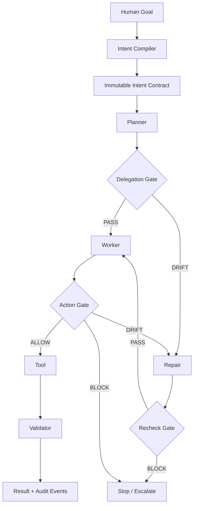

# INVARIANTX

**Runtime bảo toàn, kiểm chứng, sửa chữa ý định con người trong quy trình multi-agent tự trị.**

> Agents are free to change **HOW** they achieve the goal. INVARIANT prevents them from changing **WHAT** the human wanted.

Logistics chỉ là demo. Sản phẩm là safety và intent-integrity infrastructure cho autonomous agents.

## Core Flow



## Technology Contract v1

- **Runtime:** Python, Google ADK 2.x Graph Workflow, FastAPI.
- **Agents:** Real ADK `LlmAgent` nodes for Intent Compiler, Planner, and Worker.
- **Models:** Gemini 3.5 Flash-Lite first; Gemini 3.5 Flash escalation only.
- **Protocol:** Typed JSON events; no agent-to-agent prose.
- **Policy:** Immutable Pydantic `IntentContract`; deterministic Python first; Gemini semantic fallback.
- **Tools:** ADK Function Tools; every side effect passes the action gate.
- **State:** ADK Session State for small dynamic data; Firestore for persistence.
- **UI:** Next.js, TypeScript, XYFlow, REST, SSE.
- **Delivery:** Render native Python, Render Static Site, GitHub Actions.
- **Budget:** Maximum five LLM calls per run.

The frozen contract lives in `TECHNOLOGY-CONTRACT.md`.

## Repository

```text
backend/     FastAPI, ADK workflow, gates, evaluation
frontend/    Static Next.js dashboard and SSE client
benchmarks/  Reproducible safety baseline
deploy/      Render deployment and smoke-test guide
docs/        Demo and submission guidance
```

## Local Run

Requirements: Python 3.11+, Node.js 20+, Gemini API key.

```powershell
cd backend
python -m venv .venv
.\.venv\Scripts\Activate.ps1
pip install -e ".[test]"
$env:GEMINI_API_KEY="YOUR_KEY"
uvicorn app.main:app --reload --port 8000
```

In another terminal:

```powershell
cd frontend
npm ci
$env:NEXT_PUBLIC_API_BASE_URL="http://localhost:8000"
npm run dev
```

Open `http://localhost:3000`.

## Verify

```powershell
cd backend
pytest
python -m app.evaluation --output ..\benchmarks\baseline.json
python -m app.evaluation --benchmark --cases-per-category 10 --output ..\benchmarks\benchmark-v1.json

cd ..\frontend
npm run lint
npm run build
```

The evaluation suite covers valid delegation, omission, contradiction, weakening, objective substitution, scope expansion, repair, tool mutation, semantic ambiguity, model budget exhaustion, and persistence failure.

Benchmark Layer A methodology: `benchmarks/README.md`. Live-model fleet comparison is reserved for Layer B.

The feature-complete and truthful-claim gates are defined in `docs/COMPLETION-GOAL.md`.

## API

- `POST /runs` starts a run.
- `GET /runs/{run_id}` returns current state.
- `GET /runs/{run_id}/contract` returns the immutable contract.
- `GET /runs/{run_id}/events` streams typed SSE events.
- `POST /runs/{run_id}/cancel` requests cancellation.
- `GET /health` reports service health.

## Deploy

Provision Firestore and a least-privilege service account:

```powershell
.\scripts\bootstrap-gcp.ps1 `
  -ProjectId "YOUR_PROJECT_ID" `
  -CreateKey
```

Create a Render Blueprint from this repository, then enter `GOOGLE_CLOUD_PROJECT`, `GEMINI_API_KEY`, and the generated service-account JSON when prompted. Deployment details: `deploy/README.md`. Security policy: `SECURITY.md`. Demo script: `docs/DEMO.md`.

Core v1 production evidence is recorded in `docs/proof/core-v1.json`. The proof uses real Gemini, Google ADK Graph Workflow, Render, Firestore persistence, deliberate constraint omission, deterministic repair, tool execution, and final validation. The logistics execution receipt remains simulator-controlled for the demo; a production domain adapter must derive receipts from external state.
